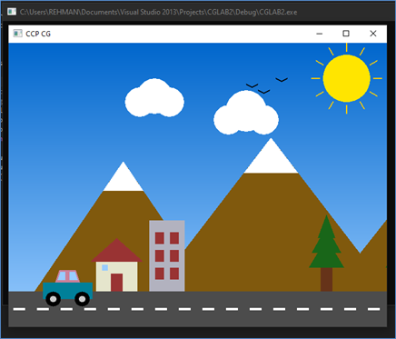
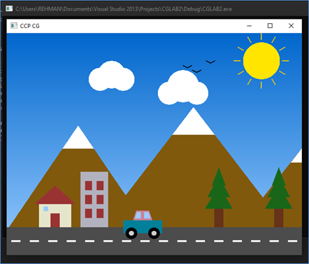
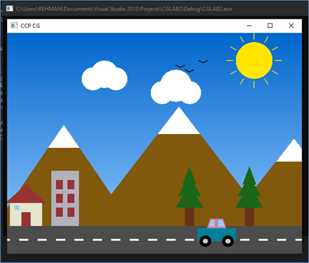

# 2D Interactive Landscape with Parallax Scrolling

## 📌 Introduction
This project is a 2D computer graphics application developed using the OpenGL library. The primary purpose of this project is to create a vibrant, interactive landscape that dynamically responds to user input, demonstrating fundamental computer graphics concepts like transformations, primitive rendering, and parallax scrolling.

### Problem Statement
> Design and implement an OpenGL program that displays a scene containing a car, the sun, clouds, trees, and mountains. The car, sun, and clouds should be able to move left, right, up, and down in response to user input.

---

## ✨ Features & Scenario Description
The scene simulates a car driving on a road, featuring several distinct layers to create a sense of depth:

* **Player Vehicle:** A detailed car that drives on the road and can switch lanes.
* **Nature Elements:** High mountains with snow caps, pine trees, and a bright sun with clouds.
* **Architecture:** A house and a taller building to add realism to the environment.
* **Atmosphere:** A gradient sky that transitions from deep blue to light blue.
* **Parallax Scrolling:**  
    When the car moves, the background (mountains, houses, and trees) moves in the opposite direction to create an illusion of speed and depth. Distant objects (like the sun and clouds) move slower than closer objects, mimicking real-world depth perception.

---

## 🎮 Controls
Use the arrow keys to interact with the scene:
* **Right Arrow (`→`):** Move the car forward (moves background left, sky left very slowly).
* **Left Arrow (`←`):** Move the car backward (moves background right, sky right very slowly).
* **Up Arrow (`↑`):** Move the car up (switch lanes).
* **Down Arrow (`↓`):** Move the car down.

---

## 📸 Output / Screenshots


**Car parked in front of the house:** 



**Car moves forward:**



**Car can Switch Lane:**



---

## 🛠️ Code Explanation & Implementation Details

Our code is organized into specific modular functions to handle different parts of the scene:

### 1. Global Variables & State Management
* `carX` and `carY`: Store the current position of the car. `carY` starts at `86.0f` to ensure the tires rest perfectly on the road.
* `bgScroll`: Tracks how much the closer background elements (mountains, house, trees) should shift.
* `skyScroll`: Tracks the distant sky elements (sun, clouds, birds). It changes at a slower rate than `bgScroll` to create depth.

### 2. Parallax Effect Logic
Inside the `specialKey` function, when the **RIGHT** arrow key is pressed:
1.  The car moves right (`carX += 5.0f`).
2.  The background moves left (`bgScroll -= 2.0f`).
3.  The sky moves left very slowly (`skyScroll -= 0.5f`).

### 3. Rendering the Scene
* **`drawCar()`:** Built using `GL_POLYGON` for the body and windows. `glScalef(0.7f, ...)` is used to scale the car appropriately.
* **`drawMountains()`:** Utilizes `GL_TRIANGLES` to create large mountains, topped with smaller white triangles to simulate snow caps.
* **`drawHouseAndBuilding()`:** Uses `GL_QUADS` to construct architecture, ensuring consistent design across the roof, doors, and windows.
* **`drawTrees()`:** Pine trees created using stacked green `GL_TRIANGLES` to fit the mountainous aesthetic.

---

## 🚀 How to Run

To compile and run this project, you will need an environment configured with OpenGL and GLUT.

**On Linux (Debian/Ubuntu):**
```bash
# Install dependencies
sudo apt-get install freeglut3-dev

# Compile the code
g++ main.cpp -o myScene -lGL -lGLU -lglut

# Run the executable
./myScene

-
